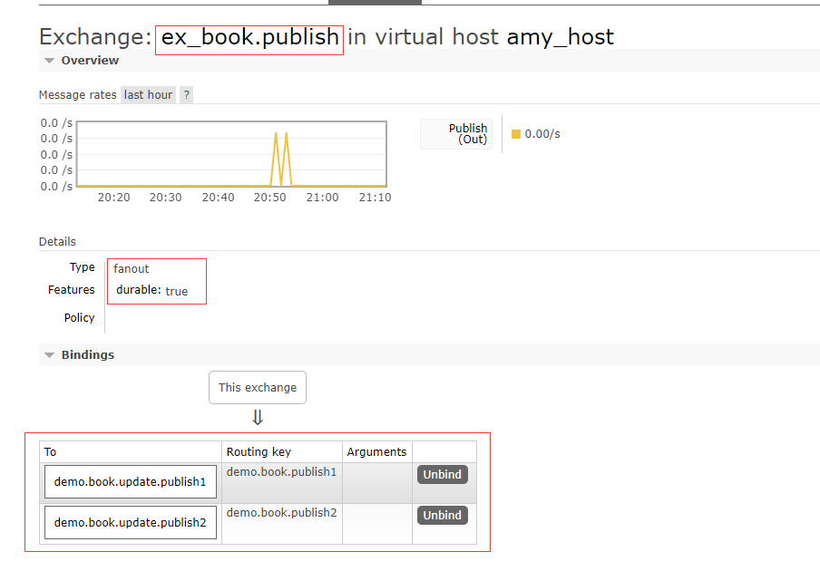
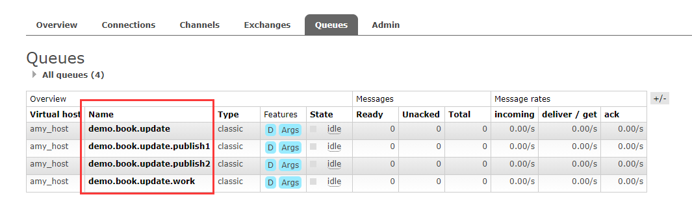

# ProjectDemo


## RabbitMQ
### 安装
1. 使用Docker安装
```
docker run -it --rm --name rabbitmq -p 5672:5672 -p 15672:15672 rabbitmq:3-management
```
2. 创建账号并授权   
``` 
rabbitmqctl add_user username passwd  //添加用户，后面两个参数分别是用户名和密码（默认密码是guest/guest）
rabbitmqctl set_permissions -p / username ".*" ".*" ".*"  //添加权限
rabbitmqctl set_user_tags username administrator  //修改用户角色,将用户设为管理员
```
3. 创建虚拟机  
```rabbitmqctl add_vhost vhost_name```
### RabbitMQ的消息模式
#### 1. Simple (简单队列)
> provider -> queues cache -> consumer
#### 2. Work queues (工作队列)
一般RabbitMQ会循环将消息从队列中分发给每一个消费者  
为了确保消息在分发过程中不会丢失，RabbitMQ支持消息确认，消费者发送回确认之后，才可以自由删除它，如果中途有消费者死亡，会将消息重新排队，分发给其他消费者  
`autoAck=true`标志自动消息确认  
消息的持久性: `durable = true` 消息存在缓存或磁盘中  
`prefetch=1` 配置表示在消费者没有处理完上一条消息之前，rabbitMQ不会把消息配发给这个消费者，而是分发给了其他的消费者
> provider -> queues cache -> consumer1, consumer2....
#### 3. Publish/Subscribe (发布/订阅)
消息发送到交换机上，由交换机将消息推入对应的队列  
无名交换：默认交换，`""`来标识，简单队列和工作队列用的就是无名交换
交换机的类型： direct, topic, headers, fanout
- fanout: 将所有的消息给它所知的队列
> provider1 -> exchange1 -> queues cache1 -> consumers  
> provider1 -> exchange1 -> queues cache2 -> consumers


